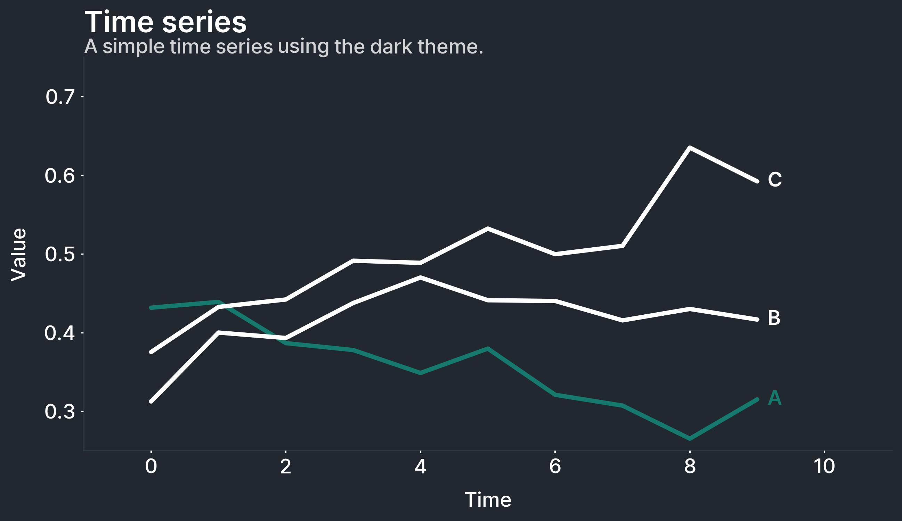

******************
1. Getting started
******************

.. meta::
   :description: Multiplex: visualizations that tell stories
   :keywords: Multiplex, Python, visualizations, data science

All of Multiplex's visualizations revolve around the :class:`~drawable.Drawable` class.
A :class:`~drawable.Drawable` is nothing more than a class that wraps a matplotlib figure and an axis.
All of the functions that you would call on a matplotlib axis, you can call on the :class:`~drawable.Drawable`.
The :class:`~drawable.Drawable` instance re-routes unknown functions to the matplotlib axis.
However, the :class:`~drawable.Drawable` also comes with new visualizations to help you explore or explain data faster.

To start working with a :class:`~drawable.Drawable`, create it from a normal plot:

.. code-block:: python

	import matplotlib.pyplot as plt
	from multiplex import drawable
	viz = drawable.Drawable(plt.figure(figsize=(10, 5)))

If you want to plot on a particular axis, or a subplot, create it as follows instead:

.. code-block:: python

	import matplotlib.pyplot as plt
	from multiplex import drawable
	figure, axis = plt.subplots(2, 1, figsize=(10, 10))
	viz = drawable.Drawable(figure, axis[0])

To learn more about how Multiplex works, keep reading the documentation.
If all you want is to get your hands dirty, take a look at the `examples <https://github.com/NicholasMamo/multiplex-plot/tree/master/examples>`_ directory.
Happy visualizing!

Drawable
========

.. automodule:: drawable
   :members:
   :private-members:
   :special-members:
