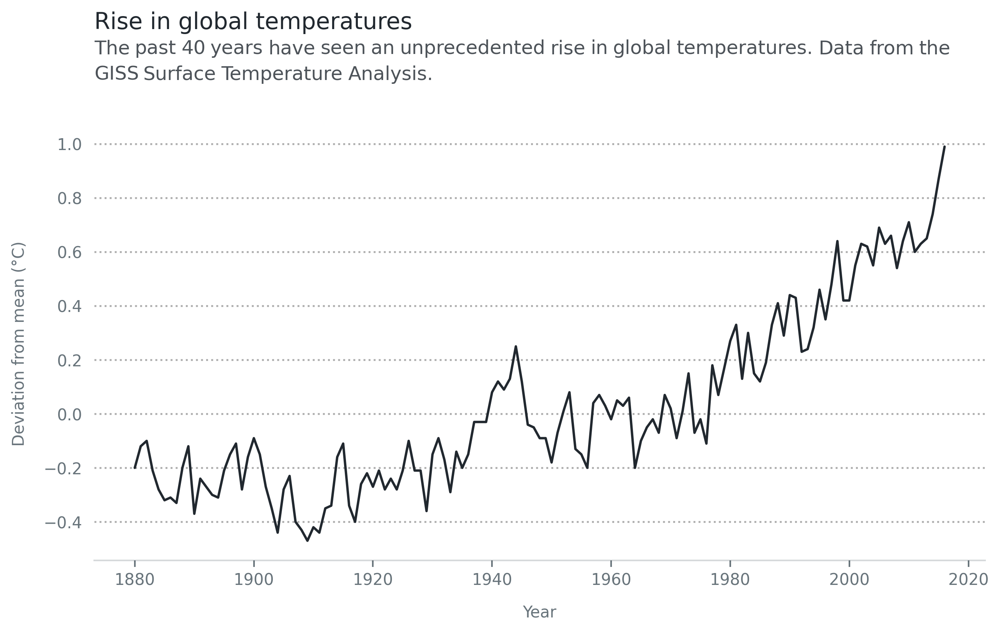

******************
1. Getting started
******************

.. meta::
   :description: Multiplex: visualizations that tell stories
   :keywords: Multiplex, Python, visualizations, data science

There is one thing that is more important than anything else in Multiplex: the :class:`~drawable.Drawable` class.
All of Multiplex's visualizations revolve around it.
Indeed, if you are using Multiplex, you can—and should—work only with :class:`~drawable.Drawable` class.

The basic process to draw Multiplex's new visualizations under the hood is as follows:

	1. Users create a :class:`~drawable.Drawable` instance.
	   This is made up of the figure and, optionally, the axes.
	   Users need only interact with the :class:`~drawable.Drawable` instance.
	2. To draw a visualization, users call the appropriate function on the :class:`~drawable.Drawable` instance.
	   These functions start with ``draw_``, for example, :func:`~drawable.Drawable.draw_time_series`.
	3. The :class:`~drawable.Drawable`, in turn, instantiates the visualization.
	   Then, it calls the :func:`~visualization.Visualization.draw` function and returns the drawn components.

To start working with a :class:`~drawable.Drawable`, create it from a normal plot:

.. code-block:: python

	import matplotlib.pyplot as plt
	from multiplex import drawable
	viz = drawable.Drawable(plt.figure(figsize=(10, 5)))

That code block would use matplotlib's default plot.
If you want to plot on a particular axes, or a subplot, you can create it as follows instead:

.. code-block:: python

	import matplotlib.pyplot as plt
	from multiplex import drawable
	figure, axes = plt.subplots(2, 1, figsize=(10, 10))
	viz = drawable.Drawable(figure, axes[0])

To learn more about how Multiplex works, keep reading the documentation.
If all you want is to get your hands dirty, take a look at `Multiplex's Jupyter Notebook examples <https://github.com/NicholasMamo/multiplex-plot/tree/master/examples>`_.
Happy visualizing!

Drawable
========

.. automodule:: drawable
   :members:
   :special-members:

Visualizations
==============

Although it is not likely that you will need them, Multiplex also contains visualization types.
These classes can help you get started creating new types of visualizations.

Basic Visualization
^^^^^^^^^^^^^^^^^^^

.. automodule:: visualization
   :members:
   :special-members:

Labelled Visualization
^^^^^^^^^^^^^^^^^^^^^^

.. automodule:: labelled
   :members:
   :special-members:

Legend
======

.. automodule:: legend
   :members:
   :special-members:
