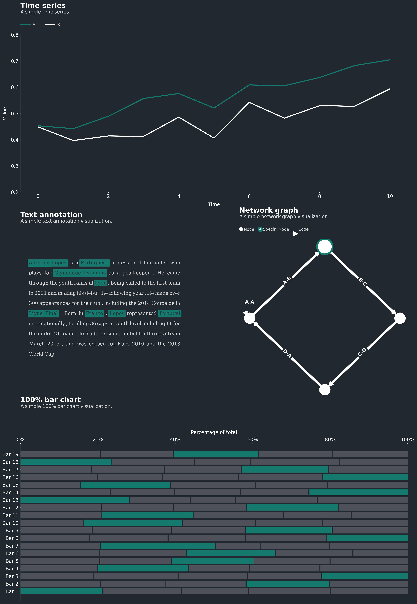

.. Multiplex documentation master file, created by
   sphinx-quickstart on Thu Dec 19 16:50:01 2019.
   You can adapt this file completely to your liking, but it should at least
   contain the root `toctree` directive.

.. title:

	Multiplex

.. meta::
   :description: Multiplex: visualizations that tell stories
   :keywords: Multiplex, Python, visualizations, data science, data analysis

.. image:: ../assets/logo.png
   :class: multiplex-logo
   :width: 400

.. image:: ../examples/exports/3-time-series.png
   :class: example

*********
Multiplex
*********

Multiplex is a visualization library for Python built on `matplotlib <https://github.com/matplotlib/matplotlib/>`_.
Multiplex follows the principle that visualizations should tell a story in a beautiful way.
This package is built with the intent of making it as easy as possible to transform data into beautiful visualizations.

.. note::

	This website documents all of Multiplex's functionality.
	If you want to get started right away, check out the `example notebooks <https://github.com/NicholasMamo/multiplex-plot/tree/master/examples>`_.

Who is Multiplex for?
=====================

Multiplex is aimed at data scientists, researchers, students and all those who work with data and are familiar with Python.
This library aims to make it easier to explore and explain data by creating beautiful visualizations.

How do I use Multiplex?
=======================

To start using Multiplex, you can clone it using pip:

.. code-block:: bash

	python -m pip install -U multiplex-plot

This website describes all of Multiplex's functionality and is only meant to be used as reference.
You can browse this website when you need to know what arguments are supported by the visualizations.

If you are a new Multiplex user, a better starting point is the `example notebooks <https://github.com/NicholasMamo/multiplex-plot/tree/master/examples>`_.

Why Multiplex?
==============

	If Multiplex is based on matplotlib, why not use matplotlib directly?

Multiplex does not replace matplotlib.
Anything that you can do with Multiplex, you can also do with matplotlib.
What Multiplex does is make it easier to create beautiful visualizations.
This is achieved by providing:

- Custom matplotlib styles;
- Functionality to caption visualizations;
- Functionality to annotate any visualization with text; and
- New types of visualizations not available in matplotlib, such as the network graph and text-based visualizations.

For example, you can create a text visualization with a simple function call, including all styling options:

.. code-block:: python
	:linenos:

	import matplotlib.pyplot as plt
	from multiplex import drawable
	plt.style.use('styles/multiplex.style')
	viz = drawable.Drawable(plt.figure(figsize=(10, 2)))
	paragraph = """Anthony Lopes is a Portuguese professional footballer who plays for Olympique Lyonnais as a goalkeeper. He came through the youth ranks at Lyon, being called to the first team in 2011 and making his debut the following year."""
	style = { 'align': 'justify', 'fontfamily': 'serif', 'alpha': 0.9, 'lineheight': 1.25, 'lpad': 0.1, 'rpad': 0.1 }
	viz.draw_text_annotation(paragraph, **style)
	viz.set_title('Profile: Anthony Lopes', loc='left')
	viz.set_caption("""Wikipedia is a useful repository to get more information about anything. Below is an excerpt from the Wikipedia profile of footballer Anthony Lopes.""")
	plt.show()

All it takes to draw a simple text visualization is 10 lines of code:

	1. Three lines to import matplotlib, Multiplex and the visualization style;
	2. Three lines to set up the visualization object, load the data and set the style;
	3. Four lines to draw and show the visualization, including a title and caption.

Multiplex abstracts the tedious process of manually programming which elements go where, and lets you create beautiful visualizations with ease.

.. toctree::
   :maxdepth: 2
   :caption: Contents:

   drawable
   text
   timeseries
   graph
   utilities

Indices and tables
==================

* :ref:`genindex`
* :ref:`modindex`
* :ref:`search`
