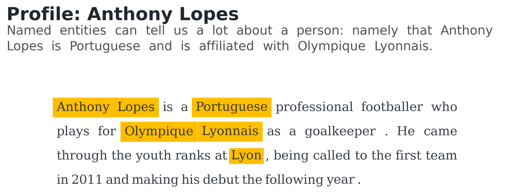

**********************
2. Text Visualizations
**********************

.. meta::
   :description: Python text visualizations for information retrieval and natural language processing (NLP)
   :keywords: Multiplex, Python, visualizations, information retrieval, natural language processing, nlp

.. automodule:: text
  :members:
  :private-members:
  :special-members:

Text visualizations are tools to help you tell your story better.
These types of visualizations give you the comfort of organizing text so that you can focus instead on the narrative.
For example, the below visualization, created using the :class:`~text.TextAnnotation` class, highlights the named entities:

Keep reading to learn more about text visualizations.

.. note::

	Check out the `text visualizations tutorial Jupyter Notebook <https://github.com/NicholasMamo/multiplex-plot/blob/master/examples/2.%20Text.ipynb>`_.

Annotation
==========

.. automodule:: text.annotation
   :members:
   :private-members:
   :special-members:

Text Annotation
===============

.. automodule:: text.text
   :members:
   :private-members:
   :special-members:
