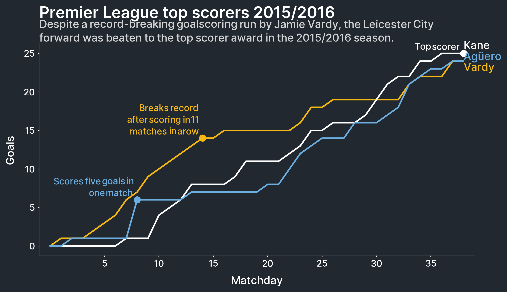

**************
3. Time Series
**************

.. meta::
   :description: Python time series visualizations that make it easier to create and annotate time series to tell a story through data
   :keywords: Multiplex, Python, visualizations, time series, big data, data mining

.. automodule:: timeseries
   :members:
   :special-members:

Time series are among the most common types of visualizations, and with good reason.
They are easy to create because they are simple, which means that they are also intuitive.
All too often, we rely on that simplicity to tell a story well.
Multiplex's time series makes it easier for data to tell a story clearly.

.. note::

	Can't wait to start creating time series visualizations?
	`Multiplex's Jupyter Notebook examples <https://github.com/NicholasMamo/multiplex-plot/tree/master/examples>`_ are a quick guide to get you up and running.
	Check out the `time series Jupyter Notebook tutorial <https://github.com/NicholasMamo/multiplex-plot/blob/master/examples/3.%20Time%20series.ipynb>`_ to learn how to create the time series shown above, or to start creating your own time series visualizations.

.. automodule:: timeseries.timeseries
   :members:
   :special-members:
